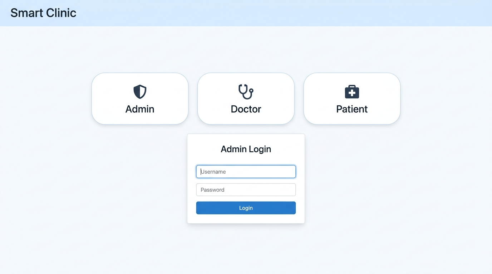
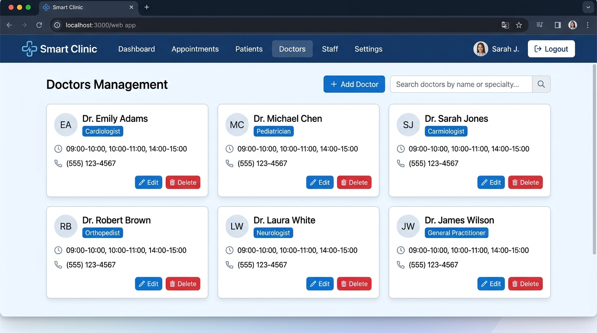

<h1 align="center">🏥 Smart Clinic Management System</h1>

<p align="center">
  A full-stack clinic management platform built with Spring Boot, MySQL, and MongoDB.
  Manage doctors, book appointments, and handle prescriptions — all in one place.
</p>

<p align="center">
  
  
  
  
  
  
</p>

<p align="center">
  <a href="https://github.com/vedant-dusane/Smart-Clinic/actions/workflows/compile-backend.yml">
    
  </a>
</p>

---

## About

Smart Clinic started as part of an IBM Full Stack Development certification capstone. After completing the course requirements, I kept going — refactoring the codebase, adding proper JWT authentication, fixing the data model, wiring up CI pipelines, and containerising the whole thing.

The end result is a working multi-role clinic platform where an **admin** manages the doctor roster, **patients** browse doctors and book hour-long appointments, and **doctors** view their daily schedule and write prescriptions stored in MongoDB.

---

## Features

- **Three-role system** — Admin, Doctor, and Patient portals with JWT-based auth
- **Doctor management** — Add, update, and remove doctors with configurable time slots
- **Appointment booking** — Patients pick a doctor and available slot; overlapping bookings are blocked
- **Prescriptions** — Doctors write prescriptions stored in MongoDB (flexible schema for varying medication lists)
- **Auto-seeded data** — On first startup, the app creates the `cms` database, runs the stored procedures, and loads sample data so there is something to work with immediately
- **Stored procedures** — Three MySQL procedures for appointment reporting by day, month, and year
- **CI pipeline** — GitHub Actions workflows for frontend linting, backend linting, compilation, and Dockerfile linting
- **Docker ready** — Run the full stack with a single command

---

## Tech Stack

| Layer | Technology |
|---|---|
| Backend | Java 17, Spring Boot 4, Spring Data JPA, Spring Data MongoDB |
| Auth | JWT (jjwt 0.12.6) |
| Relational DB | MySQL 8 |
| Document DB | MongoDB 7 |
| Frontend | HTML, CSS, vanilla JavaScript (Thymeleaf for admin/doctor dashboards) |
| Build | Maven |
| CI | GitHub Actions |
| Container | Docker, Docker Compose |

---

## Screenshots

| Role Selection & Admin Login | Admin — Doctor Management |
|---|---|
|  |  |

---

## Getting Started

### Option 1: Run with Docker Compose (easiest)

You don't need MySQL or MongoDB installed. Docker handles everything.

```bash
git clone https://github.com/vedant-dusane/Smart-Clinic.git
cd Smart-Clinic
docker compose up --build
```

Open `http://localhost:8080` once the app logs `Started`.

The default Docker credentials are in `docker-compose.yml` — feel free to change them.

---

### Option 2: Run Locally

**Prerequisites:** Java 17+, Maven 3.9+, MySQL 8, MongoDB

**1. Clone the repo**
```bash
git clone https://github.com/vedant-dusane/Smart-Clinic.git
cd Smart-Clinic
```

**2. Configure the database connection**
```bash
cp src/main/resources/application.example.properties src/main/resources/application.properties
```
Open `application.properties` and fill in your MySQL password, MongoDB URI, and a JWT secret.

**3. Start the app**
```bash
mvn spring-boot:run
```

That's it. The app will create the `cms` database, tables, stored procedures, and load sample data on first boot. Open `http://localhost:8080`.

---

## Default Sample Login Credentials

These are seeded automatically on first startup.

| Role | Identifier | Password |
|---|---|---|
| Admin | `admin` | `admin@1234` |
| Doctor | `dr.adams@example.com` | `pass12345` |
| Patient | `jane.doe@example.com` | `passJane1` |

---

## Sample Data

On startup, the initializer seeds the following records if the tables are empty:

**Doctors (25 total)** — 5 specialties: Cardiologist, Neurologist, Orthopedist, Pediatrician, Dermatologist.

| Name | Specialty | Available Times |
|---|---|---|
| Dr. Emily Adams | Cardiologist | 09:00–10:00, 10:00–11:00, 11:00–12:00, 14:00–15:00 |
| Dr. Mark Johnson | Neurologist | 10:00–11:00, 11:00–12:00, 14:00–15:00, 15:00–16:00 |
| Dr. Sarah Lee | Orthopedist | 09:00–10:00, 11:00–12:00, 14:00–15:00, 16:00–17:00 |
| … 22 more | … | … |

**Patients (25 total)** — sample names, emails, and addresses.

**Appointments (100+ total)** — spread across April–May 2025, statuses: Scheduled (0) and Completed (1).

**Prescriptions** — 24 MongoDB documents with medication and doctor notes, linked to appointment IDs.

**Stored Procedures** — automatically created on startup:
- `GetDailyAppointmentReportByDoctor(date)` — all appointments for a given day
- `GetDoctorWithMostPatientsByMonth(month, year)` — busiest doctor in a month
- `GetDoctorWithMostPatientsByYear(year)` — busiest doctor in a year

---

## API Quick Reference

Base URL: `http://localhost:8080/api`

### Auth
| Method | Endpoint | Description |
|---|---|---|
| POST | `/admin/login` | Admin login, returns JWT |
| POST | `/doctor/login` | Doctor login, returns JWT |
| POST | `/patient/login` | Patient login, returns JWT |
| POST | `/patient` | Patient registration |

### Doctors
| Method | Endpoint | Description |
|---|---|---|
| GET | `/doctor` | List all doctors |
| GET | `/doctor/filter/{name}/{time}/{speciality}` | Filter by name, time, or speciality (pass `null` to skip any filter) |
| GET | `/doctor/availability/{user}/{doctorId}/{date}/{token}` | Available slots for a doctor on a date |
| POST | `/doctor/{token}` | Add a doctor (admin only) |
| PUT | `/doctor/{token}` | Update a doctor (admin only) |
| DELETE | `/doctor/{id}/{token}` | Remove a doctor (admin only) |

### Appointments
| Method | Endpoint | Description |
|---|---|---|
| GET | `/appointments/{date}/{patientName}/{token}` | Doctor's appointments for a date |
| POST | `/appointments/{token}` | Book an appointment (patient) |
| PUT | `/appointments/{token}` | Reschedule an appointment |
| DELETE | `/appointments/{id}/{token}` | Cancel an appointment |

### Patients
| Method | Endpoint | Description |
|---|---|---|
| GET | `/patient/{token}` | Get logged-in patient's details |
| GET | `/patient/{id}/{token}` | Get a patient's appointments |
| GET | `/patient/filter/{condition}/{name}/{token}` | Filter appointments by condition or doctor name |

### Prescriptions
| Method | Endpoint | Description |
|---|---|---|
| POST | `/prescription/{token}` | Write a prescription (doctor only) |
| GET | `/prescription/{appointmentId}/{token}` | Get prescriptions for an appointment |

---

## Project Structure

```
src/
├── main/
│   ├── java/com/project/
│   │   ├── backend/
│   │   │   ├── config/          # DatabaseDataInitializer (auto-seed)
│   │   │   ├── controllers/     # REST endpoints
│   │   │   ├── dto/             # Data transfer objects
│   │   │   ├── models/          # JPA + MongoDB entities
│   │   │   ├── repositories/    # Spring Data interfaces
│   │   │   └── services/        # Business logic + JWT
│   │   └── JavaMedicalPlatformApplication.java
│   └── resources/
│       ├── application.example.properties   ← copy and fill in
│       ├── static/                          ← patient-facing HTML/JS/CSS
│       └── templates/                       ← Thymeleaf (admin/doctor dashboards)
├── .github/workflows/           # CI pipelines
├── Dockerfile
├── docker-compose.yml
└── schema-design.md             ← full database schema documentation
```

---

## Database Schema

See [`schema-design.md`](./schema-design.md) for the full MySQL and MongoDB schema with design decisions.

Quick overview of the MySQL `cms` database:

| Table | Purpose |
|---|---|
| `admin` | Admin accounts |
| `doctor` | Doctor profiles |
| `doctor_available_times` | Each doctor's available time slots |
| `patient` | Patient accounts |
| `appointment` | Appointment records linking patients and doctors |

MongoDB stores `prescriptions` in a flexible document format, making it easy to have varying numbers of medications per prescription.

---

## CI / CD

Four GitHub Actions workflows run on every push and pull request:

| Workflow | What it does |
|---|---|
| `compile-backend.yml` | Compiles the Java backend with Maven |
| `lint-backend.yml` | Runs Checkstyle against Google Java style |
| `lint-frontend.yml` | Checks HTML, CSS, and JS with htmlhint, stylelint, eslint |
| `lint-docker.yml` | Lints the Dockerfile with Hadolint |

---

## License

MIT — see [LICENSE](./LICENSE).

---

## Acknowledgements

This project began as a capstone for the IBM Full Stack Software Developer Professional Certificate (Java Development Capstone Project) . The database schema design, user stories, and initial entity models came from that coursework. Everything from the service layer, JWT auth, frontend JavaScript, CI pipelines, Docker setup, and data initialiser was built on top of that foundation.
